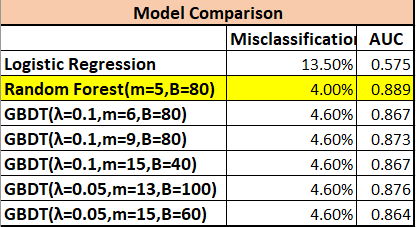

## Predict-Customer-Churn

### Project Objective
A large telecommunication company is facing the issue that customers leaving for another service provider. To mitigate churn, they are interested in identifying groups of customers with similar behaviors that could potentially help to inform strategic customer relationship programs.
The data set contains over 3000 customers and 18 variables.

### Classification Models
This project uses three classfication models by tuning parameters and then compare the model results. 
- Logistic Regression  
The model summary result shows that many variables are not significantly related to the churning behaviour.

### Model Comparison

